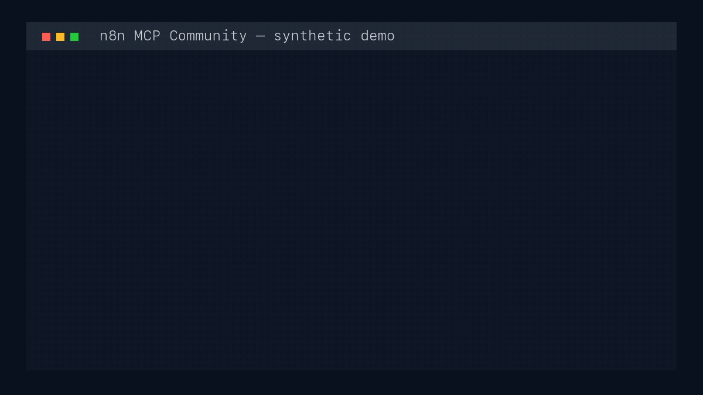

# n8n MCP Community

**A security-focused Model Context Protocol server for self-hosted n8n Community Edition.**

Connect an MCP client to n8n through 44 carefully bounded tools for workflows,
executions, credentials, tags, users, diagnostics, and instance metadata. The
server starts offline, defaults to read-only, uses the supported n8n Public API,
and never sends workflow data to an external AI provider.

> **v0.1.0:** install the exact published version or use a source checkout. See
> [Installation](docs/installation.md) for the pinned npm and signed MCPB
> options.

[Read the synthetic terminal demo transcript](docs/demo-transcript.md). It shows
the planned exact-version startup, 44-tool inventory, and local Introspect
diagnostics using only synthetic identifiers and documented output shapes.

[](docs/demo-transcript.md)

## Why this project

- **Community Edition first.** The release surface is designed for self-hosted
  n8n Community Edition, without presenting paid-only capabilities as available.
- **44 useful tools, one explicit contract.** Every tool has bounded inputs,
  documented side effects, MCP safety annotations, and contract tests.
- **Safe by default.** Read-only mode is the default. Writes and destructive or
  externally contacting operations require progressively stronger gates.
- **Deterministic Introspect.** `n8n_introspect` runs a local 23-rule engine;
  it does not execute workflows, call an agent, or contact an external model.
- **Surgical node updates.** `n8n_update_node` changes one validated node path
  while preserving the rest of the workflow and disclosing the Public API's
  non-atomic limitation.
- **Truthful discovery.** `n8n_list_node_types` reports only types observed in
  accessible workflows. It does not claim to be a complete installed catalog.
- **Data minimization.** Credential values, raw execution values, pin data, and
  static workflow data are not returned by the generic public tools.

## Current verification

The current source candidate has been verified with:

- exactly **44 tools**, **5 resources**, and **4 prompts** over real stdio;
- **271 passing tests** and the complete verification gate on Node.js 22.23.1
  and 24.18.0;
- zero findings from Gitleaks, Semgrep, Trivy, and both production/full
  `npm audit` runs; all three source scanners are reproduced in CI, with
  immutable scanner/action identities;
- a reproducible dependency-license gate covering 224 installed package paths;
- bounded same-origin HTTP contracts and zero-request policy-denial tests;
- all 44 compiled tool lifecycles on disposable n8n Community 2.30.5 and 2.30.7
  instances with egress isolation, revoked keys, cleanup, and zero residue; and
- a clean-installed npm tarball plus a byte-reproducible unsigned MCPB with the
  same compiled runtime and complete production dependency notices.

Publication proceeds only through the reviewed release procedure: the
repository-pinned MCPB signing identity, a human artifact-baseline receipt,
tag-scoped protected-environment approval, and an externally signed MCPB
handoff verified byte for byte against the reviewed unsigned candidate.

## Quick start from source

Requirements: Node.js 22 or 24, npm, a self-hosted n8n Community Edition
instance, and an n8n Public API key with only the permissions you need.

```bash
npm ci
npm run build
```

Configure your MCP client to run the compiled stdio entry point:

```json
{
  "mcpServers": {
    "n8n-community": {
      "command": "node",
      "args": ["/absolute/path/to/n8n-mcp-community/dist/index.js"],
      "env": {
        "N8N_API_URL": "https://n8n.example.com",
        "N8N_API_KEY": "replace-with-your-api-key",
        "N8N_MCP_MODE": "read-only"
      }
    }
  }
}
```

Restart the MCP client and list tools. The server can initialize and expose its
inventory without n8n credentials; connected tools validate the URL and API key
only when called.

The release provides both a signed MCPB for compatible clients and
exact-version `npx` configuration for portability. `@latest`, global installs,
and `curl | shell` are not reproducible defaults. See
[Installation](docs/installation.md) for the release policy and client-specific
guidance.

## Safety modes

| Mode      | What it allows                                                    | Required configuration                                     |
| --------- | ----------------------------------------------------------------- | ---------------------------------------------------------- |
| Read-only | Read-only tools only                                              | Default, or `N8N_MCP_MODE=read-only`                       |
| Write     | Read-only and mutation tools without the unsafe confirmation gate | `N8N_MCP_MODE=write`                                       |
| Unsafe    | All tools                                                         | `N8N_MCP_MODE=unsafe` plus the exact per-call confirmation |

Unsafe mode is necessary but not sufficient. Every unsafe call also requires a
confirmation such as `DELETE wf_123`, `STOP exec_123`, or `TEST cred_123`.
The n8n API key remains the final upstream permission boundary.

Plain HTTP is accepted automatically only for loopback URLs. A non-loopback
HTTP instance additionally requires `N8N_ALLOW_INSECURE_HTTP=1`, which accepts
the risk of exposing the API key and data in transit.

## Tool catalog

Every entry links to its complete input, output, endpoint, compatibility,
failure, and security reference.

### Workflows

| Tool                                                                   | Mode      | Purpose                                                                |
| ---------------------------------------------------------------------- | --------- | ---------------------------------------------------------------------- |
| [`n8n_workflows_list`](docs/tools.md#n8n_workflows_list)               | Read-only | List accessible workflows with bounded filters and pagination.         |
| [`n8n_workflows_get`](docs/tools.md#n8n_workflows_get)                 | Read-only | Read one workflow while withholding pin and static data values.        |
| [`n8n_workflows_create`](docs/tools.md#n8n_workflows_create)           | Write     | Create a validated workflow through the Public API.                    |
| [`n8n_workflows_update`](docs/tools.md#n8n_workflows_update)           | Write     | Guard and update selected fields while preserving omitted fields.      |
| [`n8n_update_node`](docs/tools.md#n8n_update_node)                     | Write     | Change one validated node property with non-atomic concurrency guards. |
| [`n8n_workflows_delete`](docs/tools.md#n8n_workflows_delete)           | Unsafe    | Permanently delete one workflow after exact confirmation.              |
| [`n8n_workflows_activate`](docs/tools.md#n8n_workflows_activate)       | Unsafe    | Activate one workflow after exact confirmation.                        |
| [`n8n_workflows_deactivate`](docs/tools.md#n8n_workflows_deactivate)   | Unsafe    | Deactivate one workflow after exact confirmation.                      |
| [`n8n_workflows_get_version`](docs/tools.md#n8n_workflows_get_version) | Read-only | Retrieve one retained historical workflow version.                     |
| [`n8n_workflows_get_tags`](docs/tools.md#n8n_workflows_get_tags)       | Read-only | List tags assigned to a workflow.                                      |
| [`n8n_workflows_update_tags`](docs/tools.md#n8n_workflows_update_tags) | Write     | Replace a workflow's complete tag assignment.                          |
| [`n8n_workflows_archive`](docs/tools.md#n8n_workflows_archive)         | Unsafe    | Archive one workflow after exact confirmation.                         |
| [`n8n_workflows_unarchive`](docs/tools.md#n8n_workflows_unarchive)     | Unsafe    | Restore one archived workflow after exact confirmation.                |
| [`n8n_workflows_diff`](docs/tools.md#n8n_workflows_diff)               | Read-only | Compare nodes and connections without returning raw values.            |

### Executions

| Tool                                                           | Mode      | Purpose                                                            |
| -------------------------------------------------------------- | --------- | ------------------------------------------------------------------ |
| [`n8n_executions_list`](docs/tools.md#n8n_executions_list)     | Read-only | List execution metadata with value-free data-presence summaries.   |
| [`n8n_executions_get`](docs/tools.md#n8n_executions_get)       | Read-only | Read one execution's metadata without returning workflow payloads. |
| [`n8n_executions_delete`](docs/tools.md#n8n_executions_delete) | Unsafe    | Permanently delete a saved execution.                              |
| [`n8n_executions_retry`](docs/tools.md#n8n_executions_retry)   | Unsafe    | Retry an eligible saved execution.                                 |
| [`n8n_executions_stop`](docs/tools.md#n8n_executions_stop)     | Unsafe    | Stop one running execution and bind identity from validated input. |

### Credentials

| Tool                                                             | Mode      | Purpose                                                                |
| ---------------------------------------------------------------- | --------- | ---------------------------------------------------------------------- |
| [`n8n_credentials_create`](docs/tools.md#n8n_credentials_create) | Write     | Create a credential without returning its values.                      |
| [`n8n_credentials_delete`](docs/tools.md#n8n_credentials_delete) | Unsafe    | Permanently delete one credential.                                     |
| [`n8n_credentials_schema`](docs/tools.md#n8n_credentials_schema) | Read-only | Read the public schema for a credential type.                          |
| [`n8n_credentials_list`](docs/tools.md#n8n_credentials_list)     | Read-only | List credential metadata verified on n8n 2.30.5 and 2.30.7.            |
| [`n8n_credentials_get`](docs/tools.md#n8n_credentials_get)       | Read-only | Read one credential's public metadata.                                 |
| [`n8n_credentials_update`](docs/tools.md#n8n_credentials_update) | Write     | Update credential metadata or values without echoing secrets.          |
| [`n8n_credentials_test`](docs/tools.md#n8n_credentials_test)     | Unsafe    | Test a stored credential, potentially contacting its external service. |
| [`n8n_credentials_usage`](docs/tools.md#n8n_credentials_usage)   | Read-only | Find exact credential-ID references in one bounded workflow page.      |

### Tags

| Tool                                               | Mode      | Purpose                                          |
| -------------------------------------------------- | --------- | ------------------------------------------------ |
| [`n8n_tags_list`](docs/tools.md#n8n_tags_list)     | Read-only | List workflow tags.                              |
| [`n8n_tags_get`](docs/tools.md#n8n_tags_get)       | Read-only | Read one tag.                                    |
| [`n8n_tags_create`](docs/tools.md#n8n_tags_create) | Write     | Create a tag with the live 1–24 character bound. |
| [`n8n_tags_update`](docs/tools.md#n8n_tags_update) | Write     | Rename a tag with the live 1–24 character bound. |
| [`n8n_tags_delete`](docs/tools.md#n8n_tags_delete) | Unsafe    | Permanently delete one tag.                      |

### Users

| Tool                                                 | Mode      | Purpose                                                           |
| ---------------------------------------------------- | --------- | ----------------------------------------------------------------- |
| [`n8n_users_list`](docs/tools.md#n8n_users_list)     | Read-only | List users visible to the API key.                                |
| [`n8n_users_get`](docs/tools.md#n8n_users_get)       | Read-only | Read one user by stable ID or exact email.                        |
| [`n8n_users_create`](docs/tools.md#n8n_users_create) | Unsafe    | Invite a member or admin after exact email confirmation.          |
| [`n8n_users_delete`](docs/tools.md#n8n_users_delete) | Unsafe    | Delete one API-eligible user without unsupported transfer claims. |

### Diagnostics and instance metadata

| Tool                                                                       | Mode      | Purpose                                                             |
| -------------------------------------------------------------------------- | --------- | ------------------------------------------------------------------- |
| [`n8n_health`](docs/tools.md#n8n_health)                                   | Read-only | Perform a bounded same-origin health check.                         |
| [`n8n_insights_summary`](docs/tools.md#n8n_insights_summary)               | Read-only | Read the official insights summary with optional date filters.      |
| [`n8n_audit_generate`](docs/tools.md#n8n_audit_generate)                   | Unsafe    | Generate n8n's instance security audit after exact confirmation.    |
| [`n8n_search_workflows`](docs/tools.md#n8n_search_workflows)               | Read-only | Search one workflow page locally by name, node type, or tag.        |
| [`n8n_get_node_docs`](docs/tools.md#n8n_get_node_docs)                     | Read-only | Read one of four immutable offline core-node references.            |
| [`n8n_list_node_types`](docs/tools.md#n8n_list_node_types)                 | Read-only | Inventory node types observed in bounded accessible workflow pages. |
| [`n8n_introspect`](docs/tools.md#n8n_introspect)                           | Read-only | Run deterministic local workflow and execution diagnostics.         |
| [`n8n_community_packages_list`](docs/tools.md#n8n_community_packages_list) | Read-only | List installed community-package metadata without mutation paths.   |

## Resources and prompts

The server also exposes five static resources:

- `n8n://usage-guide`
- `n8n://node-docs/webhook`
- `n8n://node-docs/code`
- `n8n://node-docs/http-request`
- `n8n://node-docs/if`

Four prompts guide safe workflow creation, debugging, optimization, and
credential management: `create-workflow`, `debug-workflow`,
`optimize-workflow`, and `manage-credentials`.

## Security model in one minute

- The server uses local stdio; it does not expose an inbound HTTP listener.
- Connected requests are same-origin and limited to the configured n8n host.
- Redirects are rejected; request and response bodies are bounded to 2 MiB.
- Generic output is validated, sanitized, bounded to 256 KiB, and wrapped as
  `{ "data": ..., "redacted": boolean, "untrusted": true }`.
- Raw credential values and generic execution payload values are never returned.
- `n8n_introspect` uses fixed local rules and has no external-model code path.
- Security controls reduce risk; they do not make untrusted n8n content safe to
  execute or authorize broader API-key permissions.

Read the complete [security model](docs/security-model.md) and use
[SECURITY.md](SECURITY.md) to report a vulnerability privately.

## Documentation

- [Documentation map](docs/README.md)
- [Getting started](docs/getting-started.md)
- [Installation and upgrades](docs/installation.md)
- [Configuration](docs/configuration.md)
- [Complete tool reference](docs/tools.md)
- [Tested examples](docs/examples.md)
- [FAQ](docs/faq.md)
- [Client configuration](docs/clients.md)
- [Architecture](docs/architecture.md)
- [Security model](docs/security-model.md)
- [Compatibility](docs/compatibility.md)
- [Troubleshooting](docs/troubleshooting.md)
- [Provenance](docs/provenance.md)
- [Roadmap](ROADMAP.md)
- [Changelog](CHANGELOG.md)

## Development

```bash
npm ci
npm run check
npm run sbom > sbom.cdx.json
```

`npm run check` verifies formatting, dependency licenses/notices, strict
TypeScript, all tests, the compiled runtime, and documentation inventory parity.
See [CONTRIBUTING.md](CONTRIBUTING.md) before opening a change.

## Scope and non-affiliation

This project is not affiliated with, endorsed by, or sponsored by n8n GmbH.
“n8n” is used only to identify compatibility with the n8n product and Public
API. The project does not redistribute the `n8n-nodes-base` catalog and does not
use browser cookies, interactive session routes, or runtime package downloads to
construct one.

The v0.1.0 surface intentionally excludes arbitrary workflow execution,
credential/workflow transfer, folders, data tables, beta evaluation endpoints,
and execution annotations. See the [roadmap](ROADMAP.md) for the annotation
proposal retained outside the release target.

## License and maintainer

The project is released under the [MIT License](LICENSE). Third-party
dependencies retain their own licenses.

Created and maintained by
[Dr. Walter Zamarian Jr.](https://www.walterzamarianjr.com/).
